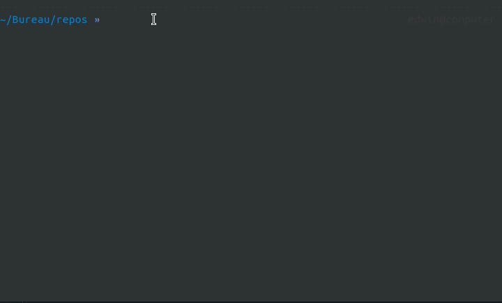
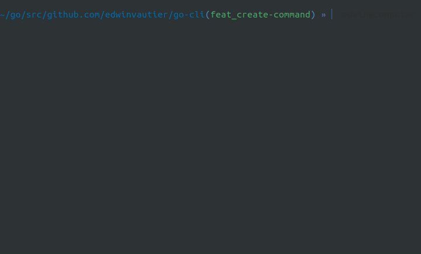

# go-cli

[](https://app.codacy.com/gh/edwinvautier/go-cli?utm_source=github.com&utm_medium=referral&utm_content=edwinvautier/go-cli&utm_campaign=Badge_Grade_Settings)
[](https://github.com/edwinvautier/go-cli/actions/workflows/go.yml)
[](https://github.com/edwinvautier/go-cli/actions/workflows/codeql-analysis.yml)
[](https://opensource.org/licenses/MIT)

A CLI to initialize and work on go projects, mainly designed for API's.

## Install

>💡 You need to have go installed correctly on your machine.

Install the CLI by running :

```sh
go get github.com/edwinvautier/go-cli
```

Then you should be able to do :



## Initialize a project

You can initialize a project in your working directory by running the `create` command.

```sh
go-cli create
# or with app name
go-cli create my-app-name
```

The CLI will eventually ask you your **git username**, the **DB management system** you'd like to use and if you want to **dockerize** the application or not.



## Release Action

> File: `.github/workflows/release.yml`

Used to create a new release with 2 inputs:
- branch
- release tag

The used GitHub Action works with 2 steps:
- go build + go test
- generate release with :
  - release name
  - tag name
  - body containing changelogs

